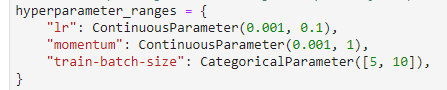
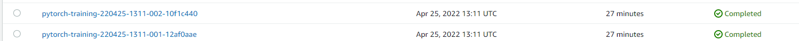
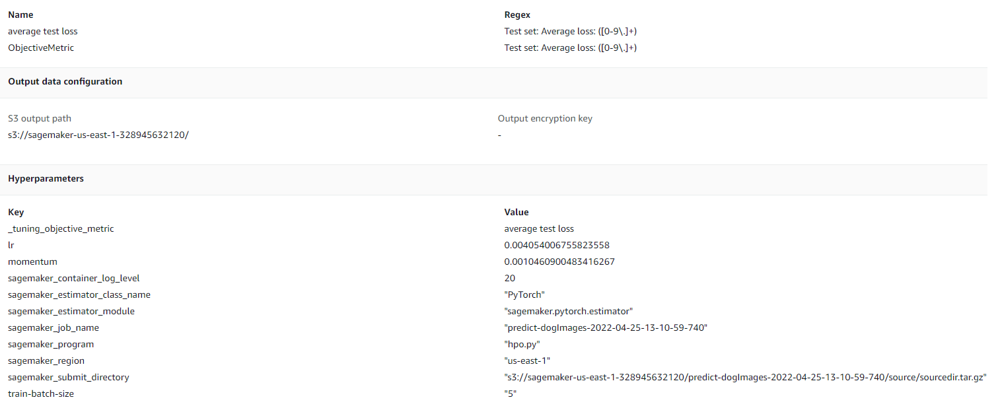
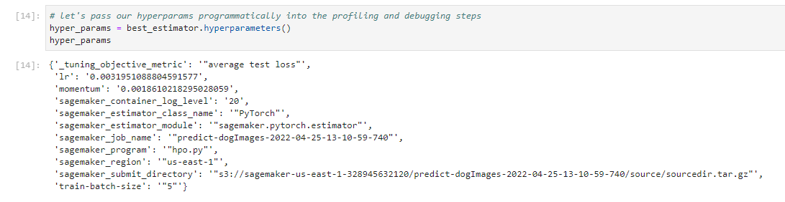
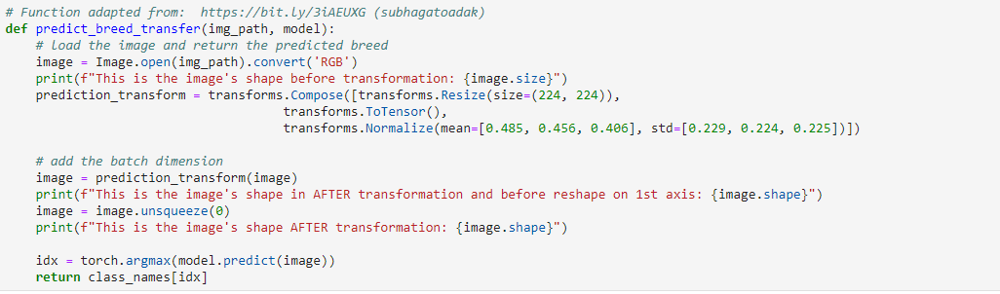
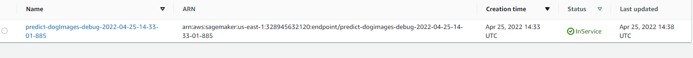

# Image Classification using AWS SageMaker

We will use AWS Sagemaker to train a pretrained model that can perform image classification by using the Sagemaker profiling, debugger, hyperparameter tuning and other good ML engineering practices. Our dataset is a the provided dog breed classication data set.

## Project Set Up and Installation

Enter AWS through the gateway in the course and open SageMaker Studio. 
Download the starter files provided to use
Download the dataset available from here: [dog breeds](https://s3-us-west-1.amazonaws.com/udacity-aind/dog-project/dogImages.zip)

## Dataset

The provided dataset is the dogbreed classification dataset which can be found in the classroom.
The project is designed to be dataset independent so if there is a dataset that is more interesting or relevant to your work, you are welcome to use it to complete the project.

### Access

We upload the data to an S3 bucket through the AWS Gateway so that SageMaker has access to the data.

## Hyperparameter Tuning

- Hyperparameters  
  
- Screenshot of two completed training jobs  
  
- Logs metrics during the training process  
  
- Retrieve the best best hyperparameters from all your training jobs
  

## Debugging and Profiling

Model debugging and profiling were performed in Sagemaker through the entry script [train_model.py](train_model.py)

### Results

See the jupyter notebook for insights the profiling/debugging steps revealed about the model

## Model Deployment

Overview of the deployed model and instructions on how to query the endpoint with a sample input.

- It's best to prepare the data first to match the dimensions the model expects with a batch size of 1.  
  

Screenshot of the deployed active endpoint in Sagemaker.
